# 学习相关 

## 转专业

以下内容可见于[【科普贴】转专业需要什么条件？如何转专业？【合肥工业大学宣城校区吧】\_百度贴吧
(baidu.com)](https://tieba.baidu.com/p/8512145460?share=9105&fr=sharewise&see_lz=0&share_from=post&sfc=copy&client_type=2&client_version=12.44.1.0&st=1689990570&is_video=false&unique=95CF34A25ADA86EDEDF5DC4065213B2E)

各位吧友们，考生们好，这几天各省份陆续公布了录取结果，有不少学弟学妹已经查到自己的专业啦这几天看到问转专业的同学比较多，所以单独开个贴讲一下。也欢迎更多亲身经历过转专业的同学来补充更多细节！

【1. 我需要转专业吗】

同学们不要在百度上查自己专业，看到几条恶评以后就开始心灰意冷。首先，评论的人和211的你大概率不是同一层次，他的出路可不一定是你的出路。比如物流管理，你去搜的话一堆人会告诉你这垃圾专业就是去一线捡快递，但实际我们根本不是。其次，现在冷门或热门的专业，谁能保证在你4年后(读研的话是7年后)毕业时和现在一样冷门或热门呢？

如果你笃定要转的话，那就接着往下看吧

【2. 转专业的条件】

大一学年排名在全专业前30％的同学将拥有转专业的资格。当然这个30％仅仅只是解锁资格，转热门的专业是远远不够的，比如想转计科的话甚至得前几名才有机会

【3. 转专业除了看成绩以外，还看什么吗】

各专业接受其他专业的学生的考核办法是自主确定的。比如2023年计算机学院是由《排名》、《笔试》、《面试》三部分成绩综合而来，三项分别占40％，35％，25％。具体规则我放在一楼，感兴趣的同学可以去看。

【4. 转专业成功之后影响保研和评奖学金吗】

当然不影响。计科每年最后保研的同学里很多都是原来从各个专业转进去的。唯一要说的就是转进去以后可能要补很多学分和很多课，会很累(据转到电信科的同学说补课真的补麻了)

【5. 打算转专业，我要做哪些准备】

首先，转专业最重要的当然是排名要高(也就是平均分要高)，而计算平均分的方法是加权平均分，即学分越高的科目占的权重越高。咱们大一学分最重的科目就是高等数学了，高数上下高达12个学分，可以说得高数者得排名了，而且计算机专业接收转专业也要单独考高数。此外，大学物理，毛概等课程学分也很重，这个开学以后同学们可以到教务里自行查看，对学分重的科目一定要好好复习，把分数考高哦

最后，欢迎大家入学合肥工业大学宣城校区，开启属于自己的光(牛)辉(马)历(时)程(光)

## 保研

保研（全称：推荐优秀应届本科毕业生免试攻读硕士学位研究生），顾名思义，就是被保送者不经过笔试等初试一些程序，通过一个考评形式鉴定学生的学习成绩、综合素质等，在一个允许的范围内，由本科所在学校推荐，并经招生单位考核后录取为研究生。（来于百度百科的介绍）简单来说，就是学校会给成绩优秀的同学资格，然后有资格的同学自己找心仪学校投简历（咱们学校保研的绝大多数都是985）所以能保上什么学校是看自己的本领

许多同学可能对保研有些或多或少的了解，咱们学校的保研率大概在14%左右，咱们学校的评比方式是

综合评价成绩=平均学业成绩50%＋创新创业及学术能力加分20%＋文艺及体育素质加分15%＋社会工作及社会实践能力加分15%

摘要

特殊情况

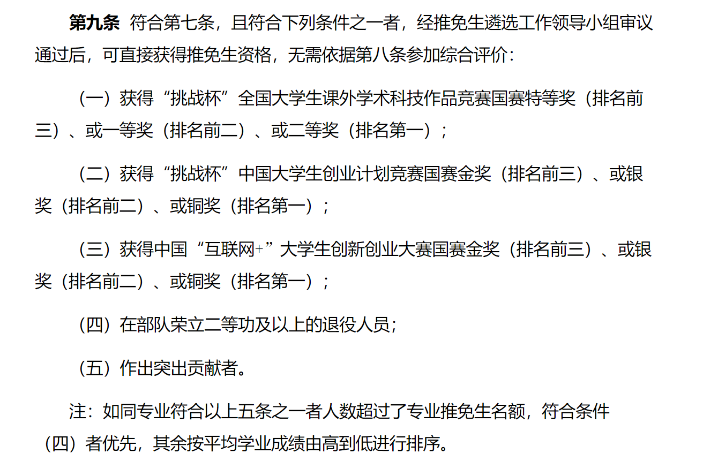

学业成绩

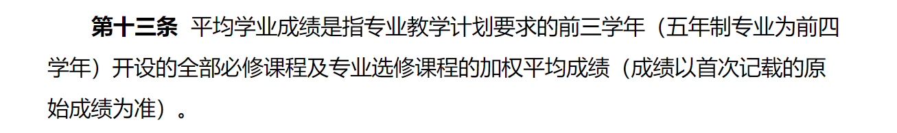

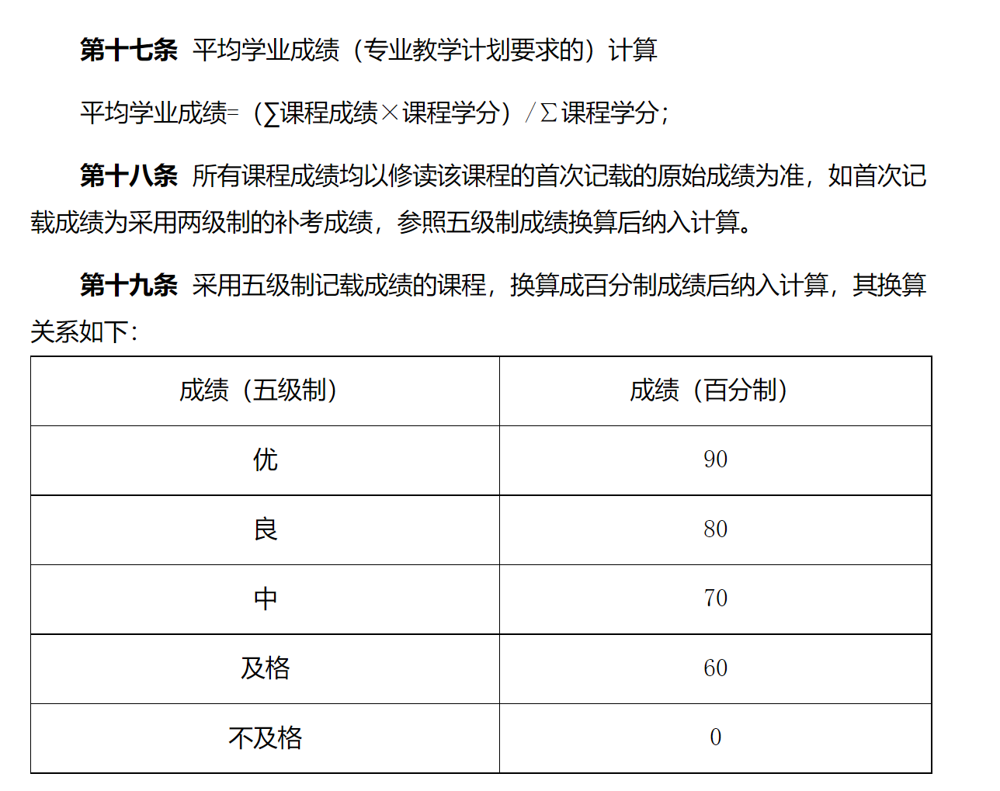

（课程只包括培养方案里有的，除了大学体育自己选的都不算）

各种加分

（一）创新创业竞赛及学术竞赛加分规则：

<table>
<colgroup>
<col style="width: 91%" />
<col style="width: 8%" />
</colgroup>
<thead>
<tr class="header">
<th>获奖情况</th>
<th>加分</th>
</tr>
</thead>
<tbody>
<tr class="odd">
<td>
“挑战杯”全国大学生课外学术科技作品竞赛国赛、“挑战杯”中国大学生创业计划竞赛国赛及中国“互联网+”大学生创新创业大赛国赛（以下简称“三大赛事”）特等奖（金奖）排名第四位或第五位，一等奖（银奖）排名第三位或第四位，二等奖（铜奖）排名第二位或第三位；

除三大赛事外的安徽省大学生学科和技能竞赛A类赛事（以下简称A类赛事）（不含体育、艺术类）特等奖（金奖）排名前两位，一等奖（银奖）排名第一位
</td>
<td>4</td>
</tr>
<tr class="even">
<td>
三大赛事特等奖（金奖）排名第六位，一等奖（银奖）排名第五，二等奖（铜奖）排名第四位；

除三大赛事外的A类赛事特等奖（金奖）排名第三位或第四位，一等奖（银奖）排名第二位或第三位，二等奖（铜奖）排名第一位或第二位；
</td>
<td>3</td>
</tr>
<tr class="odd">
<td>
除三大赛事外的A类赛事特等奖（金奖）排名第五位，一等奖（银奖）排名第四位，二等奖（铜奖）排名第三位；

安徽省大学生学科和技能竞赛B类赛事（以下简称B类赛事）（不含体育、艺术类）特等奖（金奖）排名前两位，一等奖（银奖）排名第一位;
</td>
<td>2</td>
</tr>
<tr class="even">
<td>B类赛事特等奖（金奖）排名第三位或第四位，一等奖（银奖）排名第二位或第三位，二等奖（铜奖）排名第一位或第二位；</td>
<td>1</td>
</tr>
<tr class="odd">
<td>
B类赛事特等奖（金奖）排名第五位，一等奖（银奖）排名第四位，二等奖（铜奖）排名第三位；

A、B类赛事的校级赛事特等奖（金奖）排名前两位；一等奖（银奖）排名第一位
</td>
<td>0.5</td>
</tr>
<tr class="even">
<td>A、B类赛事的校级赛事特等奖（金奖）排名第三位或第四位；一等奖（银奖）排名第二位或第三位，二等奖（铜奖）排名第一位或第二位</td>
<td>0.25</td>
</tr>
</tbody>
</table>

注：① A、B类赛事由安徽省教育厅认定并发布；

 ②如赛事最高奖为一等奖，则一等奖等同于特等奖，以此类推；

 ③B类赛事中部分全国性竞赛如有省赛，参照A、B类赛事的校级赛事标准加分。

（二）不同赛事获奖加分可累计，同一赛事多次获奖（包括同一级别赛事多次获奖和同一赛事不同级别多次获奖）不重复计算，只取加分最高的一次。

（三）不在A、B类赛事范围内的国家或省级的重要创新创业竞赛或活动，由学校相关主管部门依据赛事的重要程度，参照上述"（一）创新创业竞赛及学术竞赛加分规则"提出建议加分方案，由学校推免生遴选工作领导小组审议通过后提前公布；不在A、B类赛事范围内的国际、国家或省级的专业学术竞赛，由学院推免生遴选工作小组依据赛事的重要程度，参照上述"（一）创新创业竞赛及学术竞赛加分规则"确定加分规则，提前公布并报学校备案；A、B类赛事中如有分类不合适的赛事，学校相关主管部门或学院可提出改进建议，由学校推免生遴选工作领导小组审议通过后提前公布。

（四）大学生创新创业训练计划项目加分规则:

|                                                       |      |
|-------------------------------------------------------|------|
| 活动情况                                              | 加分 |
| 主持省级及以上大学生创新创业训练计划项目              | 1    |
| 参与省级及以上大学生创新创业训练计划项目（排名2-4位） | 0.5  |
| 主持校级大学生创新创业训练计划项目                    | 0.25 |

注：①此项加分不累计，每人只取加分最高的一次；

 ②项目必须已结题或者通过中期检查。

（五）发表所学学科专业领域内的学术论文和获所学学科专业领域相关的授权国家发明专利可获得加分，加分可累计，其具体加分规则如下：

|                                      |      |
|--------------------------------------|------|
| 发表论文及获发明专利情况             | 加分 |
| 第一作者发表高水平论文               | 2-4  |
| 第一发明人获授权国家（国际）发明专利 | 2    |
| 第一作者发表校定核心期刊论文         | 1    |
| 第一作者发表中文核心期刊论文         | 0.5  |

注：①论文和专利成果必须以合肥工业大学为第一署名单位；

 ②论文和专利成果必须来自于作者本人在学校开展的科学研究工作。

 ③高水平论文由学院按成果价值进行界定加分。

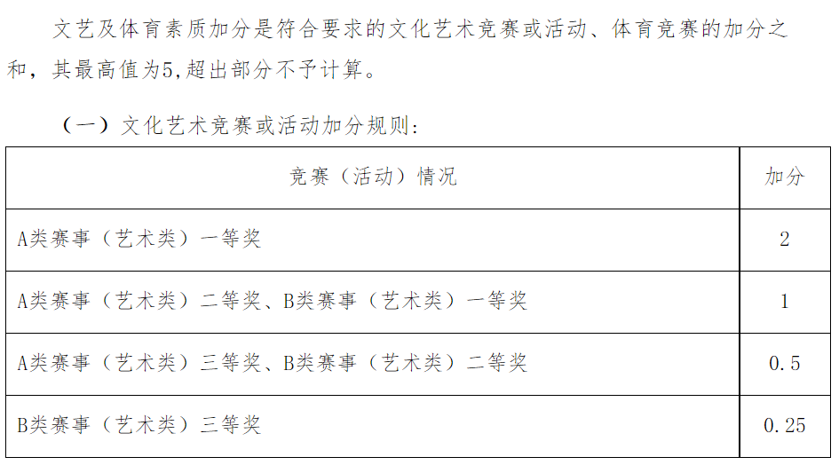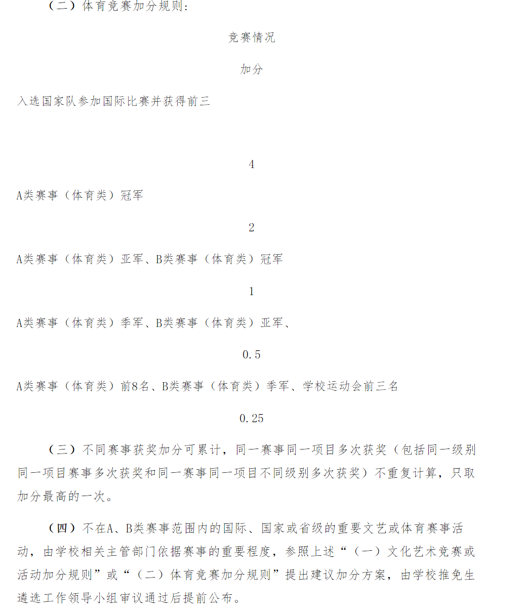

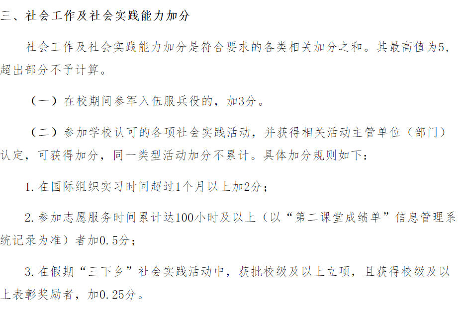

详细情况请见（官网）

<http://xcjwb.hfut.edu.cn/84/cd/c1144a33997/page.htm?eqid=a67d6f7c0009986d000000046447cde3>

关于一些专业保研去向的统计（贴吧）

<https://tieba.baidu.com/p/8535618366?pid=148255510621&cid=148256774446#148256774446>

## 竞赛

在大学中各位会遇到各种各样的竞赛，比如大创，互联网+等等,排除有些需要通过实验室参加的比赛，绝大多数比赛都是要通过自己组队报名参加的，无论你打算保研，考研，还是本科就业，打个比赛都是有用的，方便你面试时的谈论，在下面列出一些常见的比赛

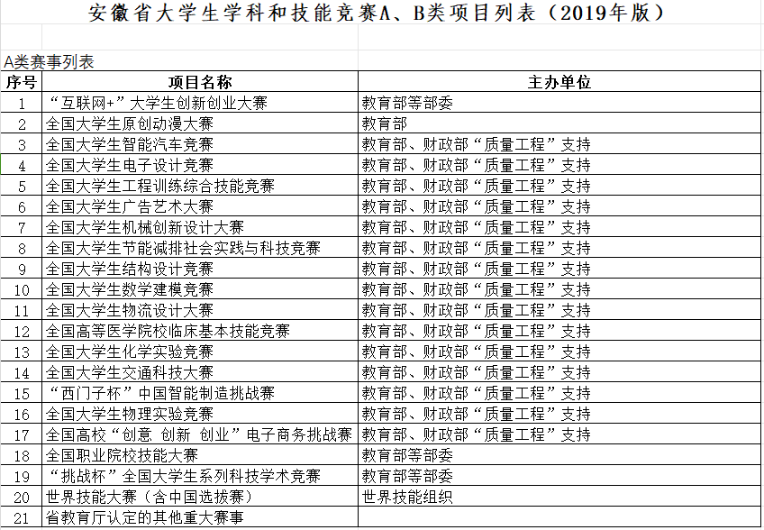

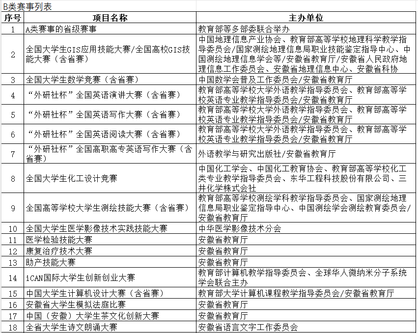

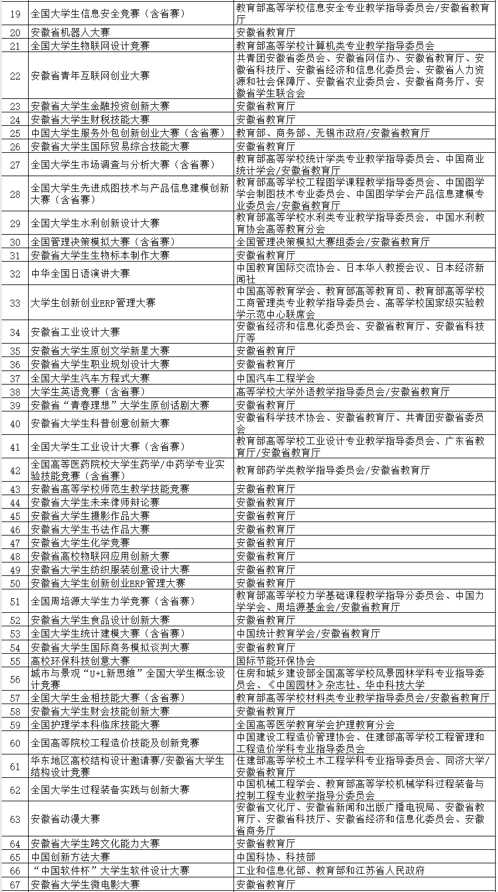

附件：

## 实验室

这里说的实验室并不是那种穿着白大褂做科研的实验室，更像是一种给本科生打比赛或者跟导师科研的平台，想进入实验室一般都是需要经过培训，笔试，面试。许多实验室会在开学晚自习时到相关专业教室宣讲，有时系里也会统一安排宣讲会（去年计算机系办了），如果非相关专业的尽量多打听打听，以防错过）宣区实验室主要有以下

电子实验室（主要打电设比赛，还有学习各种电子设计知识，要经过多次培训，写作业的那种）

ACM实验室（主要打算法比赛（包括acm，还有学习各种算法知识,想要进入需要自己在各种平台上多打算法比赛，比如牛客，codeforce等平台）

详情移步qq群543203850

WDR战队机器人技术实验室（主要打robomaster对抗赛）

详情移步qq群829938332

智能机器人实验室（好像还有个智能机器人社团，好像和这个实验有共享，社团会有培训帮助学习）

Robocup实验室（包括2D，3D，救援三个组，打Robocup比赛的）

软件工程创新实验室（搞软件工程的）

飞行器创新实验室（研究无人机之类飞行器的，也有比赛打）

AI与大数据实验室（好像分为竞赛组和科研组，研究AI的）

移动互联网创新实验室（学习内容丰富多彩，去年ppt那么说的）

## 选修介绍

选修课分为以下几种，学校替你选好过了的，在你培养方案上的选修课，这种课

## 二课介绍

第二课堂是学校为了学生全面发展要求的活动，可通过微信小程序的"第二课堂成绩单"查看，毕业要求必修模块每个至少一星，选修至少有一个一星（这个非常容易达到，学校有非常多的简单活动让你拿星星，所以根本不用愁）

以下是详情

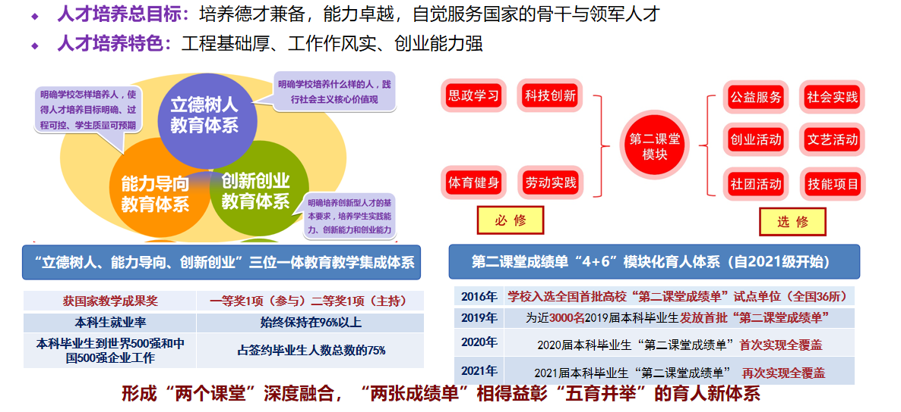

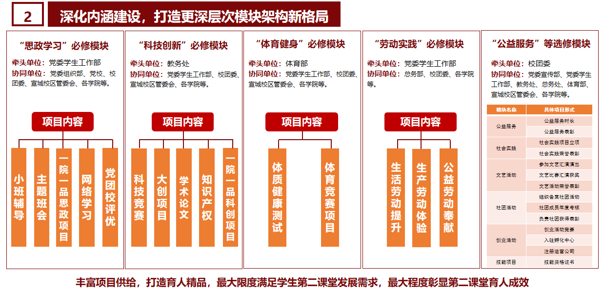

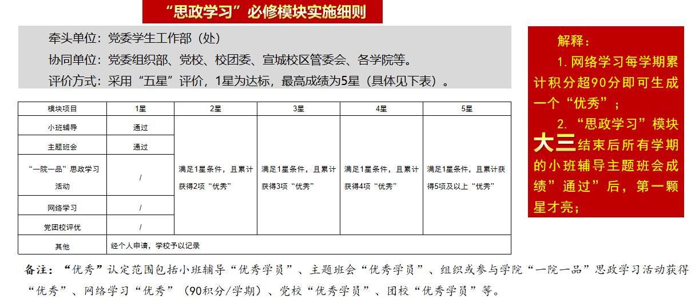

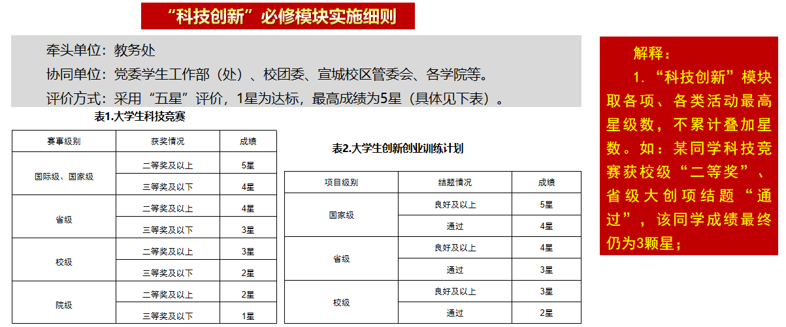

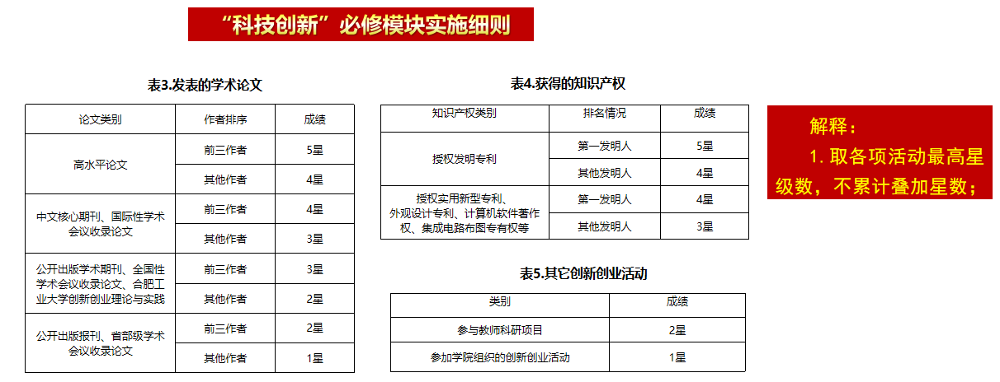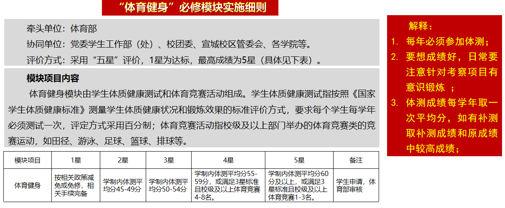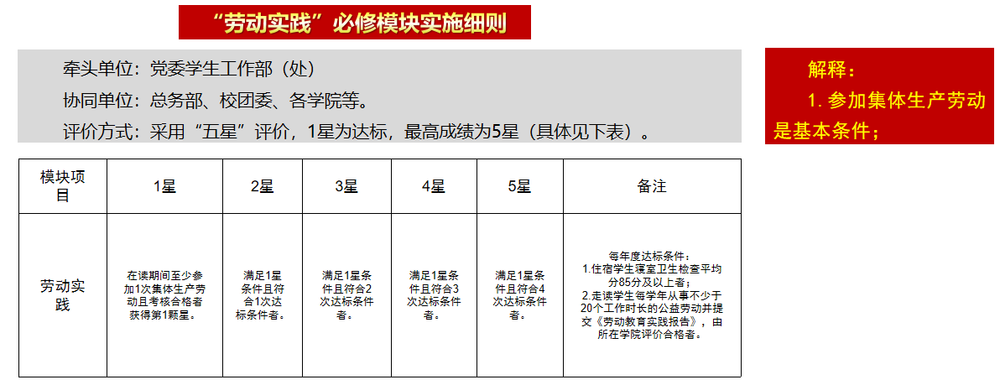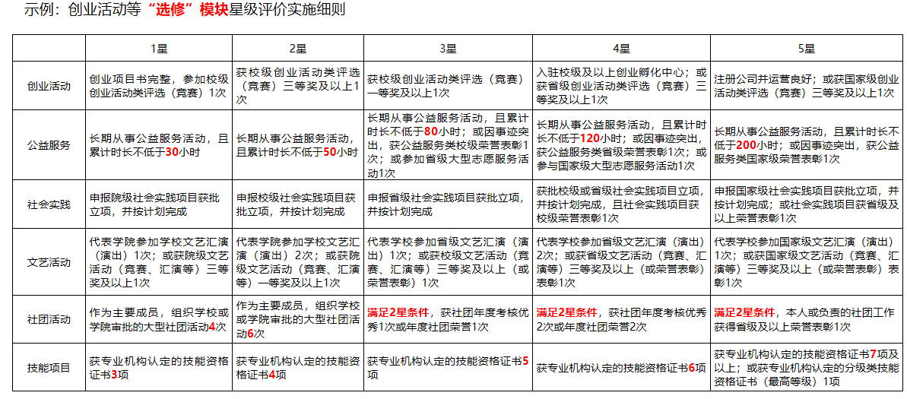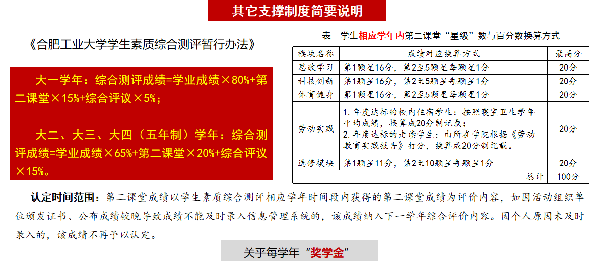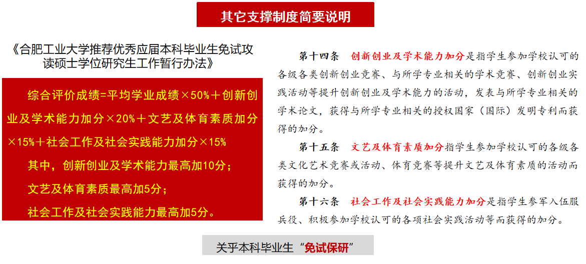

附件：

