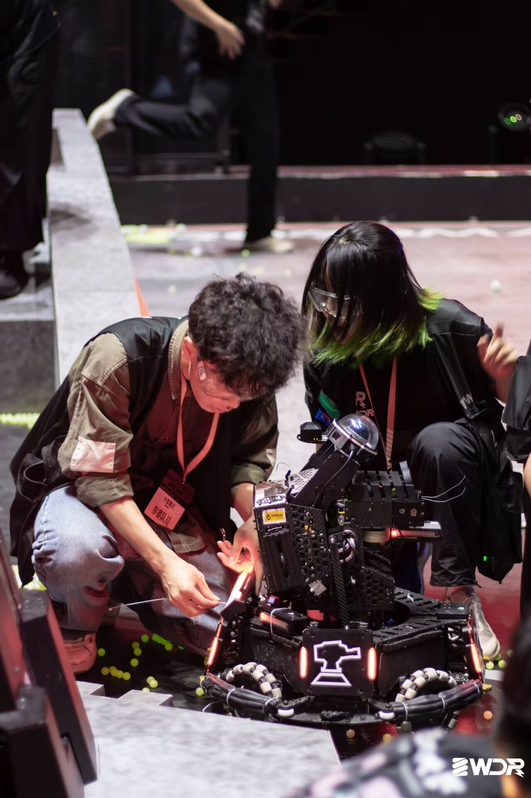
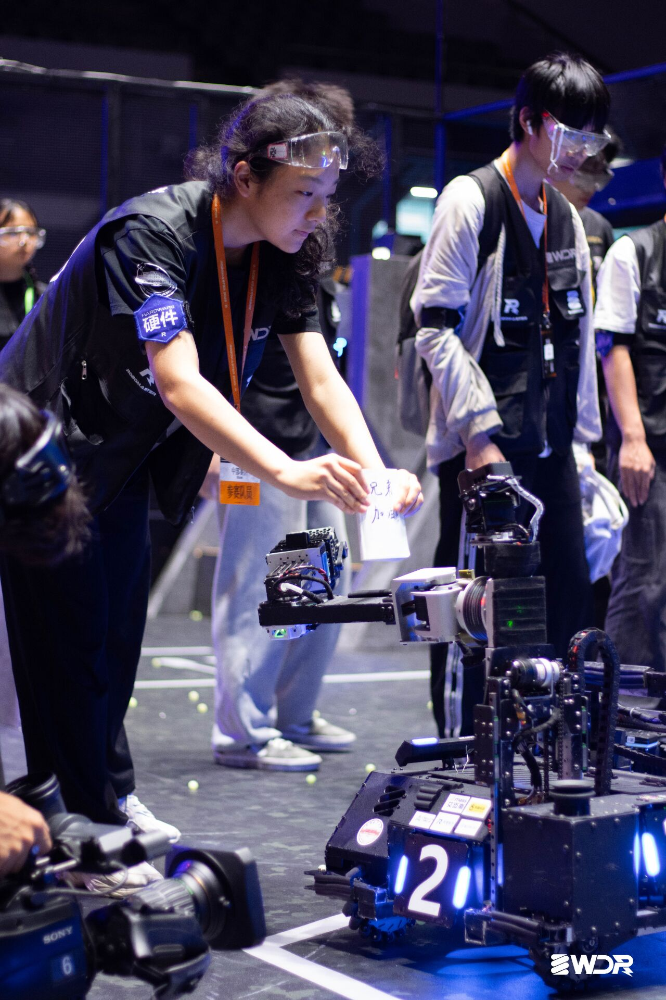
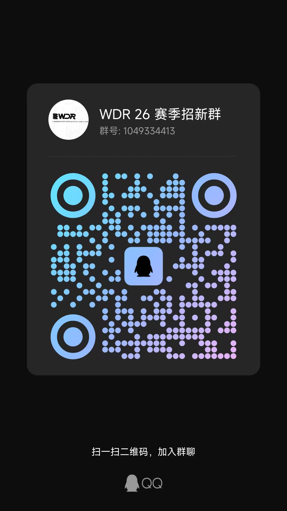
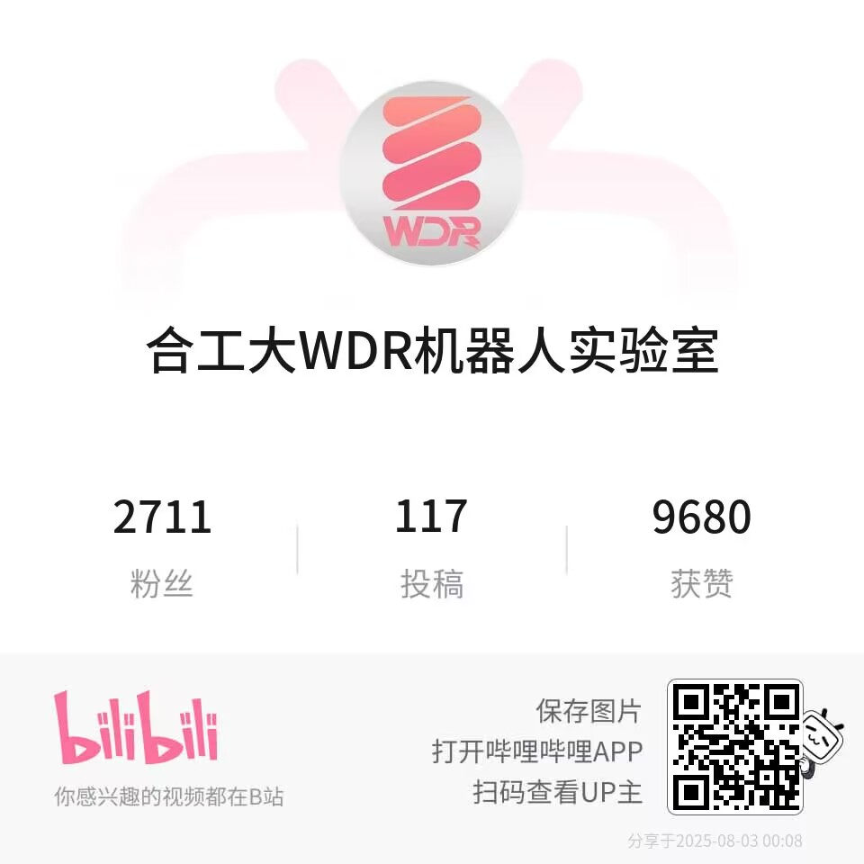

# 实验室

<HelpUs content="更多实验室的介绍" />

这里说的实验室并不是那种穿着白大褂做科研的实验室，更像是一种给本科生打比赛或者跟导师科研的平台。

想进入实验室一般都是需要经过培训，笔试，面试。许多实验室会在开学晚自习时到相关专业教室宣讲，有时系里也会统一安排宣讲会（去年计算机系办了），如果非相关专业的尽量多打听打听，以防错过）

## 电子设计创新实验室

电子设计创新实验室于 2013 年正式成立，属于合工大联合创新基地（实验室）的一部分，目前为计算机与信息系所属的大学生创新实验室。电子设计创新实验室主要以在电子设计方面培养创新能力和动手能力都强的创新型人才为目的开设的。实验室以大学生竞赛为立足点，学习相关知识，解决实际问题，同时积极申报大学生创新创业项目，从而提高综合能力。

目前负责举办校赛，并管理省赛、国赛的比赛有：

- 安徽省机器人大赛-单片机与嵌入式系统赛道
- 全国大学生智能汽车竞赛
- 全国高校计算机能力挑战赛

2024 年秋季学期招新流程为招新宣讲-七次培训（无作业）-线下考核（基础 C 语言编程&STC89C51 系列单片机的使用）-线下面试-招录为正式成员

招新一群：760092796

招新二群：907864865

## ACM 实验室

主要打算法比赛（包括 acm，还有学习各种算法知识,想要进入需要自己在各种平台上多打算法比赛，比如牛客，codeforce 等平台）

详情移步 qq 群 543203850

## WDR 战队机器人技术实验室

### 了解我们

RoboMaster 机甲大师高校系列赛，作为全国大学生机器人大赛旗下赛事之一，是专为全球科技爱好者打造的机器人竞技与学术交流平台。合肥工业大学宣城校区 WDR 战队自创立以来一直积极参与相关比赛，横跨机械、电子、算法等多学科领域，打造步兵/工程/英雄/哨兵等机器人军团。你想创作的，我们一起实现，这里是你将想法变为现实的绝佳实验室！

### 招新方向

- 电控组
  负责参赛机器人各类电子元件的选型与驱动，进行机器人控制算法的开发。成员需掌握 STM32 开发、各类控制算法与机器人的电气连接口通讯协议，拥有与硬件设计能力者为佳。
- 机械组
  负责机器人的结构设计、仿真优化、零件加工、后期维护等工作，成员有机会接触到数字孪生、增材制造、智能制造等先进制造技术，~~学习到非标零件设计选型和高端打螺丝手法等技能。~~
- 算法组
  下设自瞄、导航、雷达三技术组。分别负责目标锁定、跟踪与预测，哨兵机器人的自主导航与决策，赛场整体信息的识别与预测。成员需有稳固 C++/Python 编程能力。踏实肯干，对计算机视觉、机器学习有兴趣者为佳。
- 宣传管理组
  负责战队对外宣传与公共形象的建立。要求成员有较好的审美意识，擅长摄影、视频制作、平面设计、绘画等相关技术或有推文编写、公众号运营经验文笔较好者优先。

## 智能机器人实验室

归属于宣城校区工程素质教育中心，下辖 Pioneer 机器人协会（社团）

目前负责举办校赛，并管理省赛、国赛的比赛有：

- CIMC“西门子杯”中国智能制造挑战赛
- 中国大学生工程实践与创新能力大赛

2024 年秋季学期招新流程为招新宣讲-(社团招新-社团培训)-各组笔试/机试考核-面试-试用期-验收-招录为正式成员

招新一群：1006317751

招新二群：1001728783

## Robocup 实验室

包括 2D，3D，救援三个组，打 Robocup 比赛的

## 软件工程创新实验室

搞软件工程的

## 飞行器创新实验室

飞行器创新实验室成立于 2017 年，是宣城校区首个多学科交叉融合的实验室，以培养在程序设计与模型设计和动手能力强的创造型人才为目的。实验室曾获对地侦查与打击无人机项目全国冠军，机翼静载全国季军，安徽省电子设计竞赛无人机赛道第一名。在刚刚结束的中国大学生飞行器设计创新大赛东部赛区中，荣获多个项目的二等奖，包括机翼静载挑战、限时载运飞行、微型固定翼限距飞行，并成功入围全国总决赛。同时在暑假举行的安徽省大学生电子设计大赛中，实验室获得一等奖、二等奖、三等奖共四项，其中一等奖排名第一。自成立以来在竞赛方面成绩优异，具有强悍的实力（墙上奖状已经没地方贴啦）。

实验室参加的竞赛有：中国大学生飞行器设计创新大赛（CUADC）、全国大学生电子设计竞赛、安徽省机器人大赛等科技创新类比赛以及大创、互联网+、挑战杯、ican 等创新创业类比赛。已有作品包括对地侦察与打击无人机、创新载重无人机、空地协同智能消防系统、基于激光雷达和 ROS 的无人机地图构建和导航系统等。同时参加多项 A 类、B 类赛事。

## AI 与大数据实验室

好像分为竞赛组和科研组，研究 AI 的

## 移动互联网创新实验室

学习内容丰富多彩
